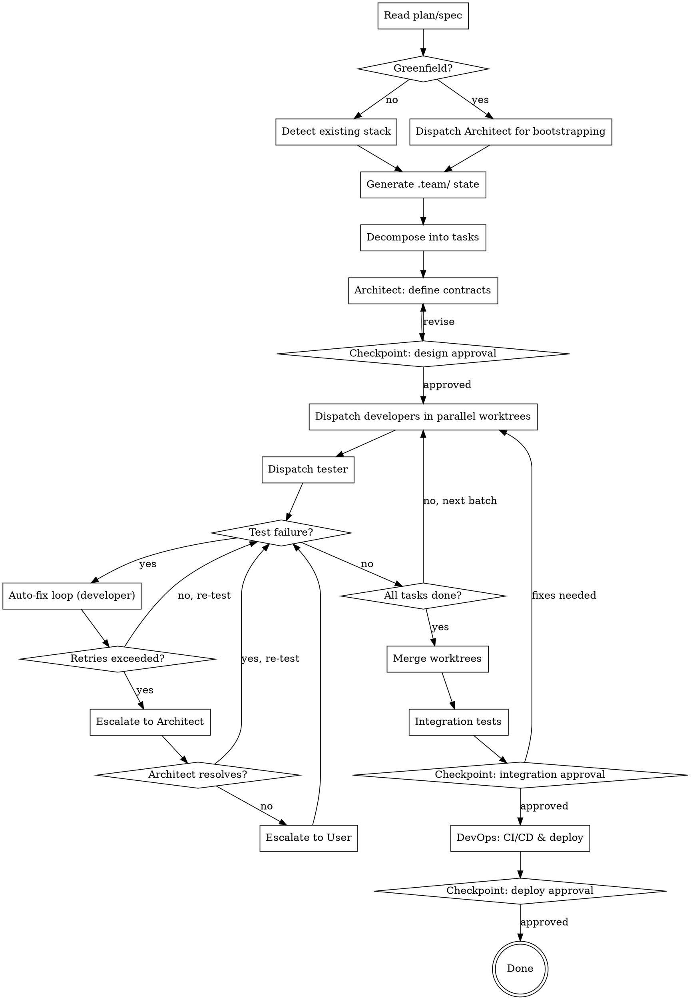

# Team Development Orchestrator

## Overview

Orchestrates a team of specialized AI agents to develop a project in parallel. Each agent has a defined role (architect, developer, tester, devops, stakeholder) and communicates through shared state files. Supports greenfield and existing projects.

## When to Use

- Starting development of a project that has a plan, spec, or technical document
- Parallelizing development work across backend, frontend, mobile, etc.
- You want automated testing feedback loops during development

## Process Flow



## Invocation

The user invokes this skill by saying something like:
- "Use team-dev to build this project"
- "Start team development with the plan at docs/plan.md"
- `/team-dev --plan docs/plan.md --autonomy semi-autonomous`

### Arguments

| Argument | Default | Description |
|----------|---------|-------------|
| `--plan` | Auto-detect in `docs/` | Path to the project plan or spec |
| `--autonomy` | `semi-autonomous` | `semi-autonomous` or `high-autonomy` |
| `--max-retries` | `3` | Max auto-fix retries before escalation |
| `--roles` | All enabled | Comma-separated roles to activate |

## Phase 1: INIT

1. **Locate the plan**: Find the plan/spec file (argument or auto-detect in `docs/`)
2. **Determine project state**:
   - Check if code already exists (look for `package.json`, `requirements.txt`, `src/`, etc.)
   - **Greenfield**: Only plan/spec exists, no code yet
   - **Existing**: Code already present, stack detectable
3. **Create `.team/` directory** in the project root with:
   - `config.json` — from template, populated with detected/configured values
   - `state.json` — from template, set phase to "init"
   - `backlog.json` — empty, will be populated next
   - `comms/` — empty directory for inter-agent messages
   - `reports/` — empty directory for test/review reports
4. **If greenfield**: Dispatch Architect agent to define the stack and create scaffolding:
   ```
   Agent(subagent_type="general-purpose", prompt="You are a System Architect. [architect skill content]. The project is greenfield. Read the plan at [path]. Define the technology stack, create the initial project structure, and generate base configuration files.")
   ```
5. **If existing**: Auto-detect the stack by scanning for known files (see `lib/prompts.md` for detection patterns). Populate `config.json` with detected stack info.

## Phase 2: DESIGN

1. **Dispatch Architect** to analyze the plan and define contracts:
   ```
   Agent(subagent_type="general-purpose", prompt="You are a System Architect. Read the plan at [path] and the current project state. Define: API contracts, database schemas, component interfaces, and conventions. Write your output to .team/reports/architecture-review.json")
   ```
2. **Decompose plan into tasks**: Break the plan into parallelizable tasks. Each task gets:
   - Unique ID (TASK-001, TASK-002, ...)
   - Title and description
   - Assigned role (developer, devops, etc.)
   - Phase (develop, deploy)
   - Dependencies (other task IDs)
   - Priority (critical, high, medium, low)
   - Files likely affected
3. **Write tasks to `.team/backlog.json`**
4. **Checkpoint** (if semi-autonomous): Present the architecture review and task breakdown to the user for approval using `AskUserQuestion`

## Phase 3: DEVELOP

1. **Group tasks by independence**: Identify tasks that can run in parallel (no shared dependencies)
2. **Dispatch developers** in parallel, each in an isolated worktree:
   ```
   Agent(
     subagent_type="general-purpose",
     isolation="worktree",
     prompt="You are a Developer. [developer skill content]. Your tasks: [task details]. Architecture contracts: [from architect]. Implement the features, write tests, and run them. Update .team/state.json with your progress."
   )
   ```
3. **Dispatch tester** to validate implementations:
   ```
   Agent(
     subagent_type="general-purpose",
     prompt="You are a QA Tester. [tester skill content]. Review the implementations and run all tests. Write results to .team/reports/test-results.json"
   )
   ```
4. **Auto-fix loop**: When tests fail:
   - Read `.team/reports/test-results.json` for failure details
   - Write a comm message to `.team/comms/` targeting the developer
   - Re-dispatch the developer with failure context and retry count
   - Track retries in the task's `autoFixRetries` field
   - If `autoFixRetries >= maxAutoFixRetries`:
     - Escalate to Architect: dispatch architect with failure context
     - If Architect cannot resolve: escalate to user via `AskUserQuestion`
5. **Repeat** until all tasks in the current batch are done, then process next batch

## Phase 4: INTEGRATE

1. **Merge worktrees**: Coordinate merging of all developer worktrees into the main branch
2. **Run integration tests**: Dispatch tester for cross-component validation
3. **Code review**: Dispatch architect to review the merged code
4. **Stakeholder validation**: Dispatch stakeholder to verify business requirements
5. **Checkpoint** (if semi-autonomous): Present integration results to user for approval

## Phase 5: DEPLOY

1. **Dispatch DevOps** to configure CI/CD and deployment:
   ```
   Agent(
     subagent_type="general-purpose",
     prompt="You are a DevOps Engineer. [devops skill content]. Set up CI/CD pipelines, Docker configuration, and deployment scripts for [detected stack]."
   )
   ```
2. **Smoke tests**: Dispatch tester for staging validation
3. **Checkpoint**: Always require user approval before production deploy

## Autonomy Levels

### Semi-Autonomous (default)
Checkpoints that require user approval:
- Design approval (Phase 2)
- Phase completion (end of each phase)
- Integration approval (Phase 4)
- Deploy approval (Phase 5)
- Conflict resolution (when agents disagree)
- Auto-fix limit exceeded

### High-Autonomy
Checkpoints that require user approval:
- Deploy approval (Phase 5) — always requires user
- Unresolvable blockers — when the escalation chain is exhausted

## State Management

The coordinator reads and updates `.team/state.json` after each significant action:

```json
{
  "currentPhase": "develop",
  "phases": {
    "init": { "status": "done", "startedAt": "...", "completedAt": "..." },
    "design": { "status": "done", "startedAt": "...", "completedAt": "..." },
    "develop": { "status": "in-progress", "startedAt": "...", "completedAt": null }
  },
  "agents": [
    { "role": "developer", "taskId": "TASK-003", "worktree": "team-dev-backend-auth", "status": "active" }
  ],
  "escalations": [
    { "taskId": "TASK-005", "from": "developer", "to": "architect", "reason": "3 auto-fix retries exhausted" }
  ]
}
```

## Error Handling

| Error | Action |
|-------|--------|
| Agent fails to produce output | Retry once, then escalate |
| Worktree merge conflict | Dispatch architect to resolve |
| Test infrastructure broken | Dispatch devops to fix, pause testing |
| Plan is ambiguous | Ask user for clarification |
| Circular dependency in tasks | Flag to user, suggest reordering |

## Sub-Skills

This skill dispatches to the following sub-skills by embedding their instructions in the agent prompt:

| Sub-Skill | Role | File |
|-----------|------|------|
| `team-architect` | System Architect | `skills/architect/SKILL.md` |
| `team-developer` | Developer | `skills/developer/SKILL.md` |
| `team-tester` | QA Tester | `skills/tester/SKILL.md` |
| `team-devops` | DevOps Engineer | `skills/devops/SKILL.md` |
| `team-stakeholder` | Business Validator | `skills/stakeholder/SKILL.md` |
